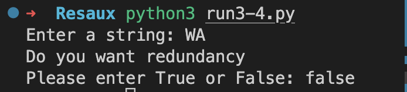
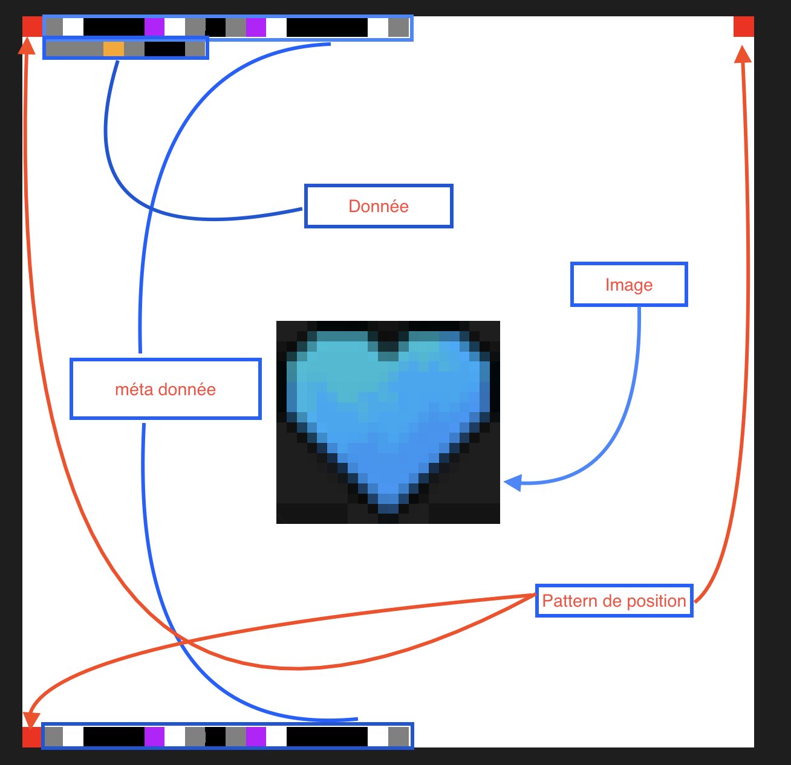
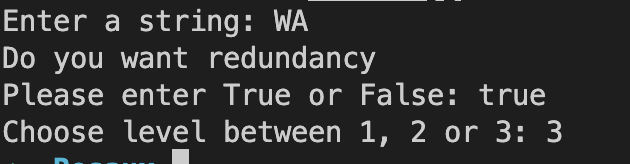
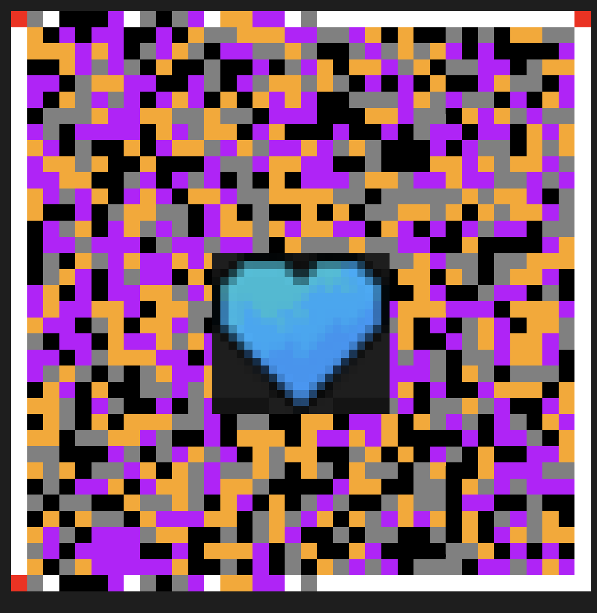

# Rapport TP réseau II

Tags: python
Status: Done

# 1. Fonctionnement

## choix de conception

Suite à notre échange avec le professeur du TP, nous avons décidé de concevoir notre code-barres en nous inspirant du QR Code.

Le QR Code encode les données octet par octet en utilisant des rectangles. Chaque rectangle contient 8 carrés (pixels) en noir et blanc : noir pour le bit 1 et blanc pour le bit 0. Ainsi, chaque octet code un caractère ASCII.

Nous avons suivi la même approche, à la différence près que nous avons choisi d'encoder les données en utilisant des couleurs. Plutôt que d'utiliser 8 carrés pour encoder 8 bits comme le fait le QR Code, nous utilisons 4 carrés colorés, chaque carré encodant 2 bits. Ainsi, 2*4 = 8 bits.

Le choix des couleurs est crucial car le modèle de couleur choisi doit offrir un contraste élevé entre les différentes couleurs, facilitant ainsi la détection et le décodage du code-barres par les scanners. C'est essentiel étant donné que notre objectif est de stocker une grande quantité de données dans un petit espace. Toute erreur de décodage du code-barres pourrait entraîner une perte ou une corruption des données. Par exemple :

```python
"00": (0, 0, 0), #noir
"01": (128, 128, 128), # gris
"10": (191, 0, 255), # violet électrique
"11": (255, 165, 0), # orange

```

## Code correcteur:

Pour la correction des erreurs, nous avons opté pour l'algorithme de Reed-Solomon plutôt que le code de Hamming. En effet, le code de Hamming ne peut corriger qu'une seule erreur de bit et détecter des erreurs de deux bits. L’algorithme de Reed-Solomon, quant à lui, est capable de corriger plusieurs erreurs, y compris les erreurs en rafale (erreurs contiguës), et peut détecter plus d'erreurs que le code de Hamming.

## Patterns de position:

Concernant les "position patterns" (les 3 carrés dans les coins du QR Code), nous avons choisi une couleur différente (le rouge par exemple) pour que le scanner puisse les distinguer des carrés de données. Nous avons décidé de placer ces carrés aux positions : (`en haut à gauche, en haut à droite, en bas à gauche`).

Le contour exterieur entre les carrés des "position patterns" est utilisée pour encoder les métadonnées et leurs redondonces. 

## Méta-données:

Les métadonnées de notre <code-barres 2D sont les suivantes :

1. **La version** : nous n'avons qu'une seule version, donc nous l'avons codée sur un seul carré gris (01) pour indiquer qu'il s'agit de la version 1.
2. **La longueur du message encodé** : nous avons limité la longueur du message à 255 caractères, donc nous l'encodons sur 4 carrés (8 bits).
3. **Dimension de l’image** : Comme l’image est un carré, on encode juste la longueur d’une arrête sur 4 carrés max (255 * 255)
4. **La taille du code-barres** : pour encoder la longueur et la largeur du code-barres (par exemple 70*70 pixels), nous encodons la longueur sur 4 carrés (8 bits) et la largeur sur 4 carrés, ce qui nous permet d'avoir une taille maximale de 255*255.
5. **Le niveau de correction** : c'est le paramètre de la fonction Reed-Solomon qui définit le taux de redondance. Nous avons choisi 4 niveaux : 0, 10, 100 et 250.

Nos données seront encodées dans l'espace entouré par les "position patterns" et les métadonnées, en commençant par la première ligne et en encodant de gauche à droite. Ensuite, nous passons à la deuxième ligne, puis nous incorporons la redondance générée par l'algorithme de Reed-Solomon.

# 2. Exemple



Suite a l’execution du programme on demande a l’utilisateur de rentrer les donner pour décoder nous avons choisis pour cette example deux lettres (WA le nom de notre protocole de communication) ensuite on demande si l’utilisateur veut la redondance. Dans cette example nous ne mettons pas de redondance pour simplifier l’explication du décodage Voici l’image ci dessous.

Dans cette image nous avons 4 détails:



## Méta donnée

La première ligne est la métadonnée, suivie d'une répétition de celle-ci à la dernière ligne pour garantir la récupération intégrale de l'information en cas de perte.

### Décodage de la métadonner

Nous avons pris comme donnée une chaîne de caractères "WA".

La métadonnée est composée de 6 sections séparées par des pixels blancs.

1. **Version des métadonnées** : Elle est composée d'un seul carré. Un carré gris correspond à **`01`** en binaire, ce qui signifie **la version 1**.
2. **Longueur du message** : Cette section est composée de 4 carrés. Nous avons 3 carrés noirs et un carré Electric Purple ce qui donne une suite binaire de **`00 00 00 10`** qui équivaut à 2, correspondant bien à la longueur du message "WA".
3. **Dimension de l'image** : Cette section est composée de quatre carrés : gris, noir, gris et Electric Purple respectivement. Cela donne une suite binaire de **`01 00 01 10`** qui équivaut à 70. Comme l'image est carrée, cela signifie que la dimension est de 70 * 70.
4. **Niveau de redondance de Reed-Solomon** : Cette section est composée de 4 carrés noirs, ce qui donne une suite binaire de **`00 00 00 00`** équivalente à 0, indiquant qu'il n'y a pas de redondance.
5. **Format de l'encodage** : Comme il s'agit d'un encodage de texte, nous avons choisi 1 pour indiquer que c'est un encodage de texte. A la fin de la métadonnée, nous avons un carré gris qui représente une suite binaire **`01`** qui équivaut à 1, ce qui correspond bien à notre encodage.

### Décodage de la donnée (message)

Dans la section des données, nous avons une suite d'informations composée de 8 carrés, car le message est de longueur 2. Chaque caractère du message est encodé sur 4 carrés.

Les quatre premiers carrés, de couleurs respectives gris, gris, gris et orange, donnent cette suite binaire **`01 01 01 11`** qui équivaut à 87 en décimal. Ce nombre correspond au caractère ASCII "W".

Les quatre carrés suivants, de couleurs respectives gris, noir, noir et gris, donnent cette suite binaire **`01 00 00 01`** qui équivaut à 65 en décimal. Ce nombre correspond au caractère ASCII "A".

## 2.1 Example avec redondance

Voici un example avec une redondance de `RSCodec(250)` :






### Ajout d’une l’image dans le WAcode:

Vu qu’on a la donnée et la redondance, on peut mettre l’image sur la redondance, le WAcode reste lisible par le scanner ou on le met sur la donnée et on peut quand même la récupérer depuis la redondance cepandant si on le met à la fois sur la redondance et la donnée, la récupération des informations perdues dépend du taux du correction des erreurs donc du niveau de correction choisi de l’algorithme du reed solomon.

# 3. Implémentation

**Importation des bibliothèques nécessaires:**

```python
# Importer les modules nécessaires
from PIL import Image, ImageDraw
from reedsolo import RSCodec
```

Dans cette partie, nous importons les modules `Image` et `ImageDraw` de la bibliothèque Python PIL (Python Imaging Library) qui nous permettront de créer une image et de dessiner des formes dessus. Nous importons également `RSCodec` du module `reedsolo`, qui fournit une implémentation Python de la correction d'erreur Reed-Solomon.

**Fonctions auxiliaires :**

```python
# Définir la fonction pour dessiner les métadonnées
def draw_meta_data(lenght_of, current_x, current_y, color_list, row):
    # Parcourir la longueur donnée
    for e in range(lenght_of):
        # Définir les coordonnées de la case
        xtuple = (current_x +2*e, row)
        Ytuple = (current_y +2*e, row+1)
        # Dessiner le rectangle avec la couleur donnée
        draw.rectangle([xtuple, Ytuple], fill=color_list[e], width=1)
    # Déplacer les coordonnées à la fin de la rangée
    xtuple = (xtuple[0]+2, xtuple[1])
    Ytuple = (Ytuple[0]+2, Ytuple[1])
    # Retourner les coordonnées mises à jour
    return xtuple, Ytuple
```

Cette fonction `draw_meta_data` dessine des données de métadonnées sur l'image. Les paramètres d'entrée comprennent lle nombre de carrés à dessiner`lenght_of`), la position de départ (`current_x` et `current_y`), la liste des couleurs (`color_list`) et la rangée à dessiner (`row`). La fonction parcourt chaque élément de la liste `color_list` et dessine un rectangle de la couleur correspondante à la position actuelle dans l'image. Les coordonnées sont mises à jour pour la prochaine case à dessiner et sont retournées à la fin de la fonction.

```python
def hccb_encode(binary_data):
    color_mapping = {
        "00": (0, 0, 0), #noir
        "01": (128, 128, 128), # gris
        "10": (191, 0, 255), # violet électrique
        "11": (255, 165, 0), # orange
    }

    segments = [binary_data[i:i+2] for i in range(0, len(binary_data), 2)]
    colors = [color_mapping[segment] for segment in segments]

    return colors
```

La fonction `hccb_encode` est utilisée pour encoder les données binaires en une liste de couleurs. La fonction prend en entrée une chaîne binaire et utilise un dictionnaire de correspondance de 
couleurs pour transformer chaque paire de bits en une couleur. Les segments sont définis par deux bits consécutifs. La fonction renvoie ensuite la liste de couleurs.

**Entrée utilisateur :**

```python
data = input("Enter a string: ")
redundancy_sol = input("Do you want redundancy \nPlease enter True or False: ")
redundancy_sol = redundancy_sol.lower()
```

Ces lignes de code demandent à l'utilisateur d'entrer une chaîne de caractères et un booléen (Vrai ou Faux) pour indiquer si l'utilisateur souhaite une redondance dans le codage.

**Transformation des données :**

```python
binary_data = ""
for c in data:
    ascii_code = ord(c)
    ascii_binary = format(ascii_code, '08b')
    binary_data += ascii_binary
```

Cette section de code transforme la chaîne de caractères entrée par l'utilisateur en données binaires.

**Application de la correction d'erreurs Reed-Solomon :**

```python
if redundancy_sol == 'true':
    solomon_level = int(input("Enter an integer: "))
    if solomon_level == 1:
        rs = RSCodec(10) 
        level_of_sol = 10
    elif solomon_level == 2:
        rs = RSCodec(100)
        level_of_sol = 100
    else:
        rs =  RSCodec(250)
        level_of_sol = 250
    encoded_data = rs.encode(bytearray(binary_data, 'utf-8'))
    encoded_data = encoded_data[::-1]
    binary_encoded_data = ''.join(format(byte, '08b') for byte in encoded_data)
    colors = hccb_encode(binary_encoded_data)
else:
    colors = hccb_encode(binary_data)
```

Si l'utilisateur a répondu "True" à la question de la redondance, le code demande à l'utilisateur de saisir un niveau de redondance sous forme d'un entier. En fonction du niveau choisi, le code utilise `RSCodec` pour ajouter une certaine quantité de redondance aux données binaires, puis utilise `hccb_encode` pour obtenir la liste de couleurs correspondant aux segments de deux bits extraits des données binaires redondantes.

Si l'utilisateur a répondu "False" à la question de la redondance, le niveau de reed solomon sera égal à 0 par défaut et le code utilise directement `hccb_encode` pour obtenir la liste de couleurs correspondant aux données binaires non redondantes. 

**Préparation de l'image :**

```python
squares_per_row = 4
square_size = 1
space_size = 1

width = 70
height = 70
image_size = max(width, height) + 2 * space_size
colored_img = Image.new("RGBA", (image_size, image_size), (255, 255, 255, 255))
draw = ImageDraw.Draw(colored_img)
```

Ces lignes de code initialisent certains paramètres pour l'image (comme la taille des carrés et l'espacement entre eux) et créent une nouvelle image de la taille spécifiée.

**Dessin des carrés colorés :**

```python
color_index = 0
border_width = 1

for y in range(1, height - 1, square_size + space_size):
    for x in range(1, width - 1, square_size + space_size):
        if color_index < len(colors):
            color = colors[color_index]
            color_index += 1
        else:
            color = (255, 255, 255)

        draw.rectangle([(1 + x, 1 + y), (1 + x + square_size, 1 + y + square_size)], fill=color, width=border_width)
```

Ces lignes de code parcourent l'image carré par carré et remplissent chaque carré avec une couleur correspondante du tableau de couleurs. Si toutes les couleurs ont été utilisées, les carrés restants sont remplis de blanc.

**Ajout de patterns de position :**

```python
# Top left position pattern
draw.rectangle([(0,0), (1,1)], fill=(255, 0, 0), width=1)

# Bottom left position pattern
bottom_left = [(0, width + square_size), (square_size, height)]
draw.rectangle(bottom_left, fill=(255, 0, 0), width=1)

# Top right position pattern
top_right = [(width, 0), (width + square_size, 1)]
draw.rectangle(top_right, fill=(255, 0, 0), width=1)
```

Ces lignes de code dessinent des carrés rouges dans les coins de l'image pour indiquer les limites de l'image.

**Ajout de métadonnées:**

```python
#    @meta data section@   #
############################
# 1. add meta data version 1
draw.rectangle([(2,0), (3,1)], fill=(128, 128, 128), width=1)
# add space between meta data
draw.rectangle([(4,0), (5,1)], fill=(255, 255, 255), width=1)
len_data = len(data)
binary_len_data = format(len_data, '08b')
len_data_color = hccb_encode(binary_len_data)
# 2. data length
x, y = draw_meta_data(len(len_data_color),6, 7, len_data_color, 0)
# add space between meta data
x, y = draw_meta_data(1,x[0], y[0], [(255,255,255)], 0)
# 3. The size of the image WAcode
len_data = width
binary_len_data = format(len_data, '08b')
len_data_color = hccb_encode(binary_len_data)
x, y = draw_meta_data(len(len_data_color),x[0], y[0], len_data_color, 0)
# add space between meta data
x, y = draw_meta_data(1,x[0], y[0], [(255,255,255)], 0)
# 4. add solomon reed redundancy level
binary_level = format(level_of_sol, '08b')
level_color = hccb_encode(binary_level)
x, y = draw_meta_data(len(level_color),x[0], y[0], level_color, 0)
# add space between meta data
x, y = draw_meta_data(1,x[0], y[0], [(255,255,255)], 0)
# 5. add meta data of encoding scheme (encoding format)
x, y = draw_meta_data(1,x[0], y[0], [(128, 128, 128)], 0)

#    @meta data redundancy@   #

##### cette partie c'est la même chose à part les coordonnées
```

Ces sections de code ajoutent les carrés des métadonnées supplémentaires à l'image, notamment la version, la longueur des données, la taille du code, le niveau de redondance.

# Affichage

```python
colored_img.save("colored_grid.png")

img1 = Image.open("colored_grid.png")
img2 = Image.open("img.png")
width, height = img2.size

img1.paste(img2, (25, 30 , 25+width, 30+height))

img1.save("output.png")
```

Ce code Python utilise la bibliothèque Pillow pour manipuler des images. Voici une explication détaillée de chaque ligne :

1. **`colored_img.save("colored_grid.png")`** : Cette ligne sauvegarde l'image stockée dans l'objet **`colored_img`** dans un fichier appelé "colored_grid.png".
2. **`img1 = Image.open("colored_grid.png")`** : Cette ligne ouvre le fichier image "colored_grid.png" précédemment sauvegardé et stocke l'objet image dans la variable **`img1`**.
3. **`img2 = Image.open("img.png")`** : Cette ligne ouvre une autre image, "img.png", et stocke l'objet image dans la variable **`img2`**.
4. **`width, height = img2.size`** : Cette ligne récupère la largeur et la hauteur de **`img2`** et les stocke dans les variables **`width`** et **`height`**, respectivement.
5. **`img1.paste(img2, (25, 30 , 25+width, 30+height))`** : Cette ligne colle **`img2`** sur **`img1`**. Les coordonnées **`(25, 30 , 25+width, 30+height)`** définissent le coin supérieur gauche et le coin inférieur droit de la zone où **`img2`** sera collée sur **`img1`**. Plus précisément, **`img2`** est collée à une position de 25 pixels vers la droite et 30 pixels vers le bas du coin supérieur gauche de **`img1`**.
6. **`img1.save("output.png")`** : Enfin, cette ligne sauvegarde l'image résultante (c'est-à-dire **`img1`** avec **`img2`** collée dessus) dans un fichier appelé "output.png".
